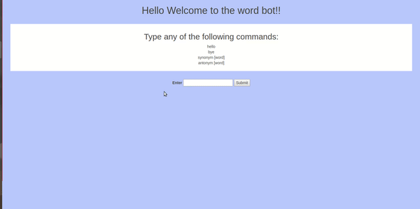

# Building Wordbot using Flask
A wordbot that will give meanigns, synonyms,antonyms of a given word.

## Technology used
* Flask
* Python
* ajax with jquery
* html,css,nltk 

## Things I learned by doing this project:
* How to use python Flask
* Introduction to nltk
* How to use Ajax with jquery

## How to run 

* install flask and nltk
* run the wordbot.py file
